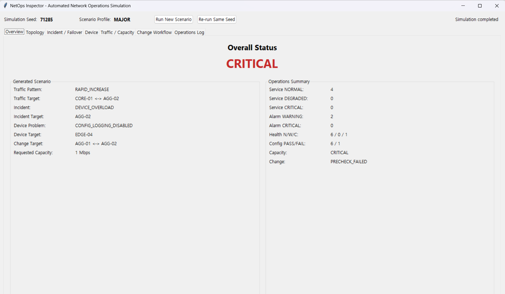
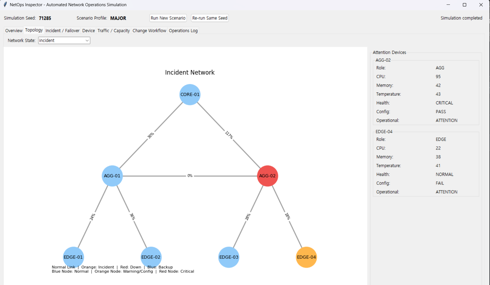
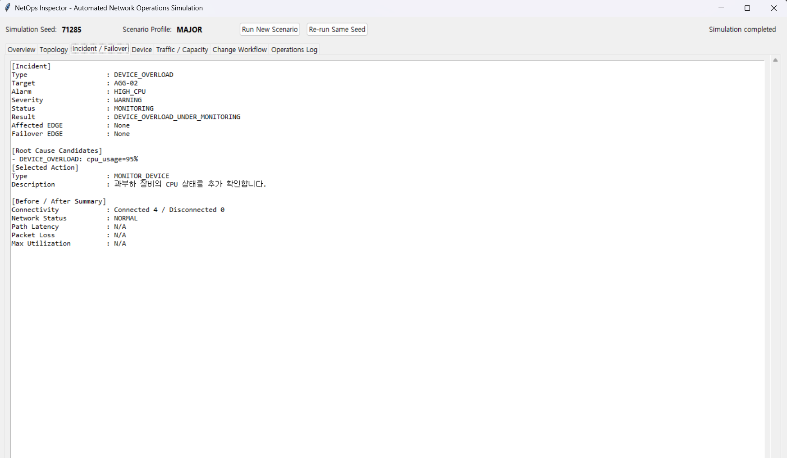
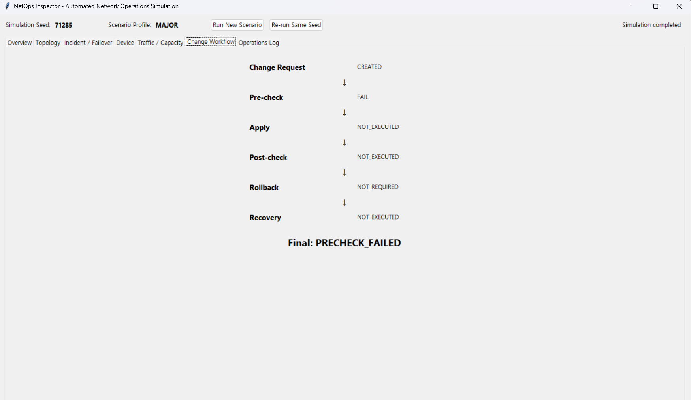

# NetOps Inspector

> Python 기반 네트워크 품질 모니터링 및 장애 대응 시뮬레이션 프로젝트

## 1. 프로젝트 개요

네트워크 운영에서
**품질 모니터링 → 이상 탐지 → 영향 범위 분석 → 원인 후보 도출 → 대응 → 정상화 검증**
과정이 어떻게 연결되는지 직접 구현하며 학습하기 위해 제작한 개인 프로젝트입니다.

Python과 NetworkX를 활용해 가상 네트워크를 구성하고,
Congestion, Link Failure, Device Overload 상황에서
utilization, latency, packet loss, CPU, memory 등 여러 지표를 기반으로
장애 원인 후보를 판단하고 대응 결과를 재검증하도록 구현했습니다.

또한 실제 Windows Ping을 통해 RTT와 Packet Loss를 수집하고,
시간에 따른 네트워크 품질 변화를 확인하도록 구성했습니다.

> **프로젝트 범위**
>
> 실제 측정 영역은 PC에서 수행한 ICMP Ping 결과입니다.
> Topology, Traffic, Device 상태, 장애 상황 등은
> 네트워크 운영 과정을 학습하기 위한 simulation입니다.

## 2. 핵심 구현 기능

### 2-1. 네트워크 품질 모니터링

Windows Ping 결과에서 RTT와 Packet Loss를 추출하고 JSONL 형태로 누적 저장합니다.

수집한 값을 시간 순서로 비교하여 평상시 상태와 품질 변화 여부를 확인하고,
Threshold 기반으로 이상 징후를 탐지하도록 구성했습니다.

### 2-2. 장애 시나리오 및 원인 후보 분석

가상 네트워크에서는 다음 장애 중 하나가 발생하도록 구현했습니다.

- Congestion
- Link Failure
- Device Overload

장애를 발생시키는 기능과 원인을 진단하는 기능을 분리했습니다.

따라서 진단 로직은 어떤 장애가 발생했는지 미리 알지 못한 상태에서

- Link Utilization
- Latency
- Packet Loss
- Device CPU / Memory
- Link Status

등의 관측 값을 이용해 원인 후보를 판단합니다.

실제 네트워크 운영에서도 장애의 정답을 미리 알고 분석하는 것이 아니라,
관측 가능한 여러 지표를 통해 문제 범위를 좁혀야 한다고 판단했기 때문입니다.

### 2-3. Failover 이후 품질 재검증

Link Failure가 발생하면 사용 가능한 Backup Path를 탐색하고 Traffic을 우회시킵니다.

우회 성공 여부만 확인하지 않고,
우회 경로의 Utilization과 Latency, Packet Loss를 다시 평가하도록 구성했습니다.

장애를 피하기 위해 Traffic을 다른 경로로 전환하더라도
새로운 경로의 부하가 증가해 서비스 품질이 저하될 수 있다고 판단했기 때문입니다.

### 2-4. 네트워크 변경 전후 검증

가상 Link Capacity 변경 과정은 다음 순서로 구현했습니다.

Pre-check → Change → Post-check → Success / Rollback

변경 전 상태를 먼저 확인하고,
변경 이후 품질이 기준을 만족하지 못하면 기존 상태로 복구하도록 구성했습니다.

네트워크 변경 자체가 새로운 장애나 품질 저하의 원인이 될 수 있기 때문에,
변경 수행뿐 아니라 변경 이후의 정상화 검증까지 포함해야 한다고 판단했습니다.

## 3. 서비스별 네트워크 품질 판단

네트워크 품질은 모든 서비스에서 동일한 기준으로 평가하기 어렵다고 판단했습니다.

예를 들어 실시간 통신처럼 응답 속도가 중요한 서비스는 Latency 변화가 사용자 경험에 직접 영향을 줄 수 있고,
데이터 전송이 중요한 서비스는 Packet Loss 증가가 재전송과 품질 저하로 이어질 수 있습니다.
또한 Traffic이 많은 서비스에서는 Link Utilization 증가가 Congestion 가능성을 판단하는 중요한 지표가 될 수 있습니다.

| Service Type | 우선 확인 Metric | 판단 이유 |
|---|---|---|
| Real-time Service | Latency | 응답 지연이 사용자 경험에 직접 영향을 줄 수 있음 |
| Data Transfer Service | Packet Loss | 손실 증가가 재전송 및 전송 품질 저하로 이어질 수 있음 |
| High Traffic Service | Utilization | Link 부하 증가와 Congestion 가능성을 판단할 수 있음 |

따라서 서비스 Flow별로 Latency, Packet Loss, Utilization을 확인하고,
서비스 특성에 따라 중요한 Metric의 우선순위를 다르게 적용하도록 구성했습니다.

단순히 Network의 Up/Down 여부만 판단하는 것이 아니라,
연결 이후 실제 서비스 품질까지 확인하는 운영 관점을 프로젝트에 반영하고자 했습니다.

## 4. Network Operation Workflow

프로젝트의 전체 운영 흐름은 다음과 같이 구성했습니다.

```text
Normal Monitoring
        ↓
Anomaly Detection
        ↓
Impact Analysis
        ↓
Root Cause Candidate
        ↓
Response / Failover
        ↓
Post-check
        ↓
Service Quality Verification
        ↓
Recovery Complete

장애를 발견한 뒤 바로 조치하는 것이 아니라,
먼저 영향 범위와 원인 후보를 좁힌 뒤 대응하고,
대응 이후에도 서비스 품질이 정상화됐는지 다시 확인하도록 구성했습니다.

이는 네트워크 운영이 단순 복구가 아니라
모니터링 → 진단 → 대응 → 검증의 반복 과정이라고 판단했기 때문입니다.

5. Simulated Network Topology

가상 네트워크는 Core, Aggregation, Edge 계층으로 구성했습니다.

                 CORE-01
                /       \
           AGG-01-------AGG-02
           /   \         /   \
      EDGE-01 EDGE-02 EDGE-03 EDGE-04

CORE-01 : Core Network 역할
AGG-01, AGG-02 : Aggregation 역할
EDGE-01 ~ EDGE-04 : 사용자 및 서비스 연결 구간
AGG-01 ↔ AGG-02 : 장애 발생 시 활용할 수 있는 Backup Link

정상 상태에서는 기본 경로를 사용하고,
Link Failure가 발생하면 사용 가능한 우회 경로를 탐색해 Traffic을 재분배하도록 구성했습니다.

## 6. Project Structure

프로젝트는 기능별로 모듈을 분리해 구성했습니다.

```text
netops-inspector/
├─ collect_ping.py
├─ analyze_metrics.py
├─ detect_anomaly.py
├─ network_simulator.py
├─ traffic_trend_analyzer.py
├─ device_health_checker.py
├─ failover_analyzer.py
├─ change_analyzer.py
├─ change_workflow_manager.py
├─ incident_manager.py
├─ time_series_simulator.py
├─ service_quality_analyzer.py
├─ event_alarm_manager.py
├─ integrated_operations_report.py
├─ network_inventory.py
├─ dashboard.py
├─ network_metrics.jsonl
└─ requirements.txt

| Module                            | 역할                                            
| --------------------------------- | --------------------------------------------- 
| `collect_ping.py`                 | Windows Ping을 실행해 RTT와 Packet Loss 수집         
| `analyze_metrics.py`              | 누적된 품질 지표의 변화 분석                              
| `detect_anomaly.py`               | Threshold 기반 이상 징후 탐지                         
| `network_simulator.py`            | 가상 Topology, Traffic, 장애 상황 생성                
| `traffic_trend_analyzer.py`       | Traffic 변화와 혼잡 가능성 분석                         
| `device_health_checker.py`        | CPU, Memory 등 가상 장비 상태 확인                     
| `failover_analyzer.py`            | Link Failure 이후 Backup Path 및 품질 분석           
| `change_analyzer.py`              | Capacity 변경 전후 상태 비교                          
| `change_workflow_manager.py`      | Pre-check, Change, Post-check, Rollback 흐름 관리 
| `incident_manager.py`             | 장애 탐지부터 대응까지 Incident Workflow 수행             
| `time_series_simulator.py`        | 시간 흐름에 따른 Metric 변화 생성                        
| `service_quality_analyzer.py`     | 서비스별 E2E 품질 분석                                
| `event_alarm_manager.py`          | Metric 변화 기반 Event 탐지 및 Alarm 기록              
| `integrated_operations_report.py` | 주요 운영 결과를 통합해 정리                              
| `network_inventory.py`            | 가상 Network 자원 및 구성 정보 관리                      
| `dashboard.py`                    | 주요 결과를 Streamlit 화면으로 시각화                     

Topology는 실제 데이터센터 망을 그대로 재현한 것이 아니라,
Redundancy, Failover, Traffic 재분배 등 네트워크 운영 개념을 학습하기 위해 단순화한 구조입니다.

## 7. My Role & Engineering Decisions

Python 코드 제작에는 Codex를 활용했지만,
프로젝트의 운용 시나리오와 장애 판단 기준은 직접 설계하고
실행 결과를 확인하며 개선 방향을 결정했습니다.

특히 다음과 같은 기준을 두고 프로젝트 구조를 설계했습니다.

### 7-1. 장애 생성부와 진단부 분리

Congestion, Link Failure, Device Overload 중 하나가 발생하도록 구성하되,
진단 로직은 어떤 장애가 발생했는지 사전에 알 수 없도록 분리했습니다.

실제 네트워크 운영에서도 장애의 정답을 알고 분석하는 것이 아니라,
관측 가능한 상태를 바탕으로 원인을 추론해야 한다고 판단했기 때문입니다.

### 7-2. 여러 Metric을 함께 사용한 원인 분석

하나의 Metric만으로 장애 원인을 판단하지 않고

- Utilization
- Latency
- Packet Loss
- CPU
- Memory
- Link Status

등을 함께 확인하도록 구성했습니다.

E2E 서비스 품질 저하는 여러 원인이 복합적으로 영향을 줄 수 있으므로,
단일 지표보다 여러 상태 정보를 함께 비교해야 한다고 판단했습니다.

### 7-3. 대응 이후 품질 재검증

Link Failure 이후 Backup Path로 Traffic을 우회한 뒤
Connectivity만 확인하지 않고 Utilization, Latency, Packet Loss를 다시 평가했습니다.

우회 경로의 부하가 증가하면 연결은 복구되더라도
서비스 품질이 저하될 수 있다고 판단했기 때문입니다.

### 7-4. 변경 전후 검증과 Rollback

Capacity 변경 과정에 Pre-check와 Post-check를 두고,
변경 이후 상태가 기준을 만족하지 못하면 Rollback하도록 구성했습니다.

네트워크 변경 자체도 새로운 장애나 품질 저하의 원인이 될 수 있으므로,
변경 성공 여부보다 변경 이후의 정상 상태 확인이 중요하다고 판단했습니다.

### 7-5. 서비스 특성에 따른 품질 기준 구분

모든 서비스에서 같은 Metric을 우선해서 볼 수 없다고 판단했습니다.

지연에 민감한 서비스는 Latency,
데이터 손실에 민감한 서비스는 Packet Loss,
Traffic이 많은 서비스는 Utilization을 우선적으로 확인하도록 구분했습니다.

이를 통해 Network의 Up/Down 여부뿐 아니라
서비스 특성을 고려한 E2E 품질 판단을 프로젝트에 반영했습니다.

## 8. How to Run

### 8-1. 실행 환경

- Python 3.x
- Windows 기준
- 필요한 패키지는 `requirements.txt` 참고

### 8-2. 패키지 설치

```bash
pip install -r requirements.tx

8-3. 주요 기능 실행

실제 Ping 기반 품질 데이터 수집
python collect_ping.py

저장된 Metric 분석
python analyze_metrics.py

이상 징후 탐지
python detect_anomaly.py

가상 네트워크 및 장애 시나리오 실행
python network_simulator.py

Incident Workflow 실행
python incident_manager.py

서비스별 품질 분석
python service_quality_analyzer.py

Streamlit Dashboard 실행
streamlit run dashboard.py

각 모듈은 기능별로 분리되어 있어 개별 실행이 가능하며,
일부 기능은 network_simulator.py를 중심으로 연계해 동작하도록 구성했습니다.

## 9. Execution Results

프로젝트의 주요 동작 결과는 아래와 같이 확인할 수 있습니다.

### 9-1. 전체 운영 상태

생성된 Traffic Pattern, Incident, Device 상태, Capacity 상태와 Change 결과를 한 화면에서 요약하도록 구성했습니다.



### 9-2. 장애 발생 시 Topology 상태

Incident 발생 시 영향을 받는 장비와 Link 상태를 Topology에 표시하고,
CPU, Memory, Health, Config 등 장비 상태를 함께 확인할 수 있도록 구성했습니다.



### 9-3. 장애 원인 후보 분석

발생한 장애 유형을 진단 로직이 미리 알지 못한 상태에서
관측된 Metric을 바탕으로 Root Cause Candidate를 제시하도록 구현했습니다.

아래 예시에서는 AGG-02의 CPU Usage가 95%까지 증가한 상태를 확인하고
Device Overload를 원인 후보로 판단합니다.



### 9-4. 변경 전 Pre-check

Network 변경은 바로 실행하지 않고 Pre-check를 먼저 수행하도록 구성했습니다.

변경 전 상태가 기준을 만족하지 못하면 Apply와 Post-check를 진행하지 않고
변경 작업을 중단하도록 했습니다.



이는 이미 이상 상태인 Network에 추가 변경을 수행할 경우
장애 영향이 커질 수 있다고 판단했기 때문입니다.
